Linear Regression in R
================
Melvin Galera
2024-03-06

- [I. Overview](#i-overview)
- [II. Objective](#ii-objective)
- [III. Data](#iii-data)
- [III. Exploratory Analysis](#iii-exploratory-analysis)
  - [A. Univariate Analysis](#a-univariate-analysis)
  - [B. Bivariate Analysis](#b-bivariate-analysis)
  - [C. Multivariate Analysis](#c-multivariate-analysis)
- [IV. Fitting and Evaluation of Linear
  Model](#iv-fitting-and-evaluation-of-linear-model)
  - [Splitting the dataset](#splitting-the-dataset)
  - [Improving the model](#improving-the-model)
  - [Comparing the Models in terms of R2 and
    RSE](#comparing-the-models-in-terms-of-r2-and-rse)
- [V. Residuals and Residual Plots](#v-residuals-and-residual-plots)
  - [Statistical test](#statistical-test)
- [Predicting from test data](#predicting-from-test-data)

------------------------------------------------------------------------

## I. Overview

The dataset has 1338 observations and 7 variables:

- `age` : the person’s age
- `sex` : either male or female
- `bmi` : body mass index
- `children` : the number of children in the person;s family
- `smoker` : if the person is smoker or not (‘yes’ or ‘no’)
- `region` : the region where the person resides (‘southwest’,
  ‘southeast’, ‘northwest’, ‘northeast’)
- `charges` : the amount of medical cost

## II. Objective

The objective is to develop a predictive model for medical cost using
linear regression based on the given predictor variables.

## III. Data

Initial look at the structure and content of `insurance_df` dataset:

``` r
str(insurance_df)
```

    ## 'data.frame':    1338 obs. of  7 variables:
    ##  $ age     : int  19 18 28 33 32 31 46 37 37 60 ...
    ##  $ sex     : chr  "female" "male" "male" "male" ...
    ##  $ bmi     : num  27.9 33.8 33 22.7 28.9 ...
    ##  $ children: int  0 1 3 0 0 0 1 3 2 0 ...
    ##  $ smoker  : chr  "yes" "no" "no" "no" ...
    ##  $ region  : chr  "southwest" "southeast" "southeast" "northwest" ...
    ##  $ charges : num  16885 1726 4449 21984 3867 ...

``` r
insurance_df %>% head(10)
```

    ##    age    sex    bmi children smoker    region   charges
    ## 1   19 female 27.900        0    yes southwest 16884.924
    ## 2   18   male 33.770        1     no southeast  1725.552
    ## 3   28   male 33.000        3     no southeast  4449.462
    ## 4   33   male 22.705        0     no northwest 21984.471
    ## 5   32   male 28.880        0     no northwest  3866.855
    ## 6   31 female 25.740        0     no southeast  3756.622
    ## 7   46 female 33.440        1     no southeast  8240.590
    ## 8   37 female 27.740        3     no northwest  7281.506
    ## 9   37   male 29.830        2     no northeast  6406.411
    ## 10  60 female 25.840        0     no northwest 28923.137

## III. Exploratory Analysis

To perform EDA on the dataset, we perform univariate distribution of the
variables and the bivariate and multivariate relationships among the
variables.

### A. Univariate Analysis

1.  Charges

<!-- -->

    ##    Min. 1st Qu.  Median    Mean 3rd Qu.    Max. 
    ##    1122    4740    9382   13270   16640   63770

2.  Age

<!-- -->

    ##    Min. 1st Qu.  Median    Mean 3rd Qu.    Max. 
    ##   18.00   27.00   39.00   39.21   51.00   64.00

3.  BMI

<!-- -->

    ##    Min. 1st Qu.  Median    Mean 3rd Qu.    Max. 
    ##   15.96   26.30   30.40   30.66   34.69   53.13

4.  Sex

The distribution of `sex` based on count and proportion are:

``` r
table(insurance_df$sex)
```

    ## 
    ## female   male 
    ##    662    676

``` r
prop.table(table(insurance_df$sex))
```

    ## 
    ##    female      male 
    ## 0.4947683 0.5052317

5.  Smoker

The distribution of `smoker` based on count and proportion are:

``` r
table(insurance_df$smoker)
```

    ## 
    ##   no  yes 
    ## 1064  274

``` r
prop.table(table(insurance_df$smoker))
```

    ## 
    ##        no       yes 
    ## 0.7952167 0.2047833

6.  Region

The distribution of \`region\`\` based on count and proportion are:

``` r
table(insurance_df$region)
```

    ## 
    ## northeast northwest southeast southwest 
    ##       324       325       364       325

``` r
prop.table(table(insurance_df$region))
```

    ## 
    ## northeast northwest southeast southwest 
    ## 0.2421525 0.2428999 0.2720478 0.2428999

7.  Number of children

The distribution of `children_num` based on count and proportion are:

``` r
table(insurance_df$children_num)
```

    ## 
    ##   0   1   2   3   4   5 
    ## 574 324 240 157  25  18

``` r
prop.table(table(insurance_df$children_num))
```

    ## 
    ##          0          1          2          3          4          5 
    ## 0.42899851 0.24215247 0.17937220 0.11733931 0.01868460 0.01345291

    ##    Min. 1st Qu.  Median    Mean 3rd Qu.    Max. 
    ##   0.000   0.000   1.000   1.095   2.000   5.000

Create age group

Univariate plots 1

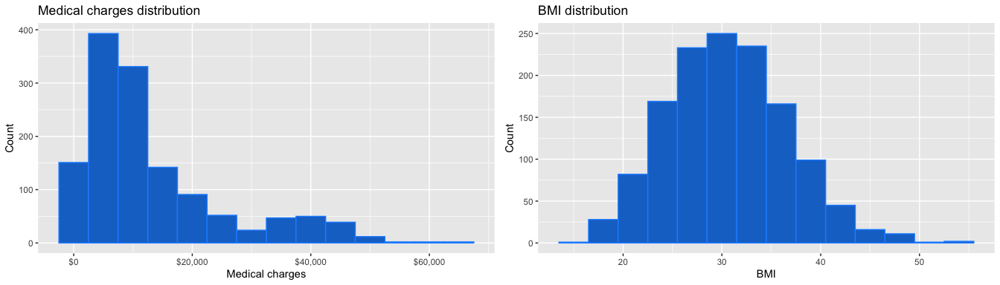

Univariate plots 2

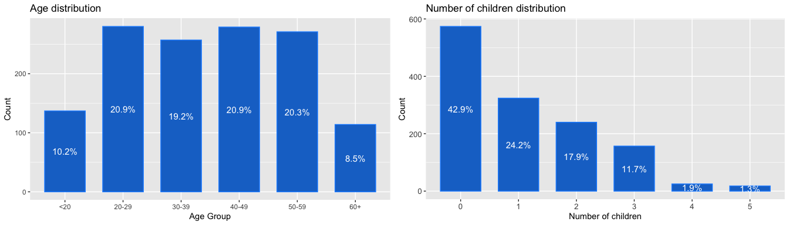
Univariate plots 3

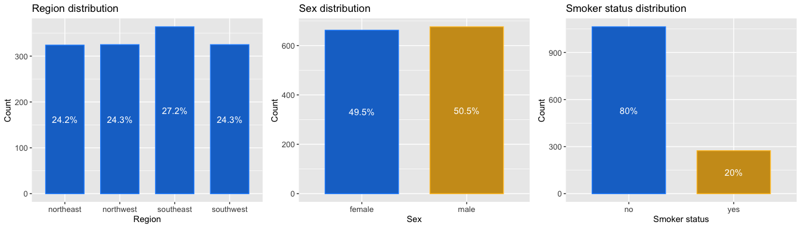

### B. Bivariate Analysis

Charges and sex; charges and region

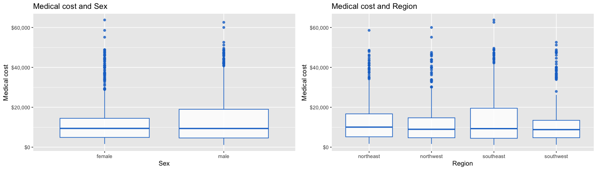

4.  Charges and smoker; charges and children

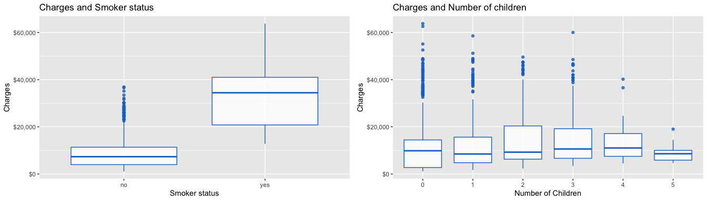

### C. Multivariate Analysis

1.  Charges, age, sex; Charges, age and smoker

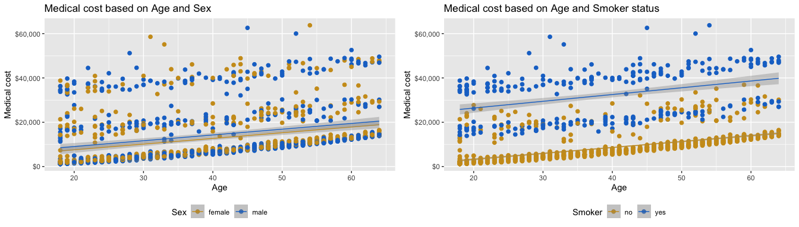

2.  Charges, bmi and sex; charges, bmi and smoer

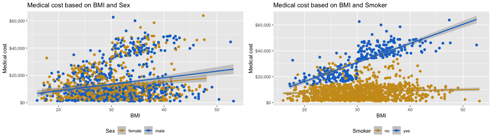

7.  Correlation

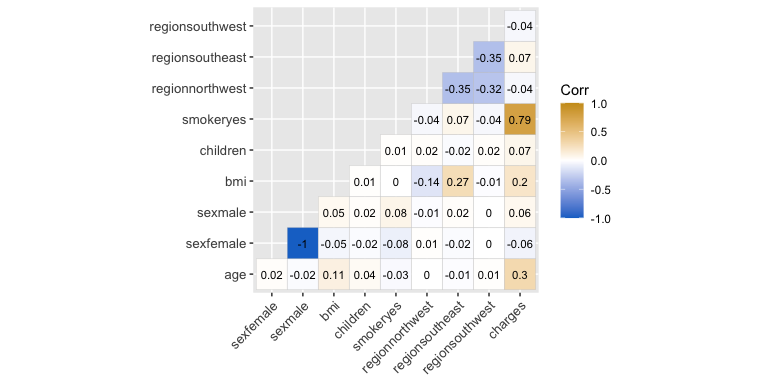

## IV. Fitting and Evaluation of Linear Model

### Splitting the dataset

Split the dataset: 80% training data and 20% test data

    ## [1] 1070

    ## [1] 268

1.  Model 1 (all) (charges ~ age + children + bmi + sex + smoker +
    region)

<div align="center">

*charges = $\beta_{0}$ + $\beta{1}$age + $\beta{2}$bmi +
$\beta{3}$children + $\beta{4}$sex + $\beta{5}$smoker +
$\beta{6}$region + $\epsilon$*

</div>

``` r
model_01 <- lm(charges ~ age + bmi + children + sex + smoker + region, data = training_data)

summary(model_01)
```

    ## 
    ## Call:
    ## lm(formula = charges ~ age + bmi + children + sex + smoker + 
    ##     region, data = training_data)
    ## 
    ## Residuals:
    ##      Min       1Q   Median       3Q      Max 
    ## -11514.2  -2822.8   -928.6   1514.4  29451.4 
    ## 
    ## Coefficients:
    ##                  Estimate Std. Error t value Pr(>|t|)    
    ## (Intercept)     -12318.92    1103.51 -11.163  < 2e-16 ***
    ## age                257.79      13.37  19.281  < 2e-16 ***
    ## bmi                347.54      31.88  10.901  < 2e-16 ***
    ## children           511.23     155.54   3.287  0.00105 ** 
    ## sexmale            182.50     374.69   0.487  0.62630    
    ## smokeryes        24177.04     463.55  52.156  < 2e-16 ***
    ## regionnorthwest   -446.83     533.98  -0.837  0.40290    
    ## regionsoutheast  -1050.89     539.87  -1.947  0.05185 .  
    ## regionsouthwest  -1342.26     541.18  -2.480  0.01328 *  
    ## ---
    ## Signif. codes:  0 '***' 0.001 '**' 0.01 '*' 0.05 '.' 0.1 ' ' 1
    ## 
    ## Residual standard error: 6105 on 1061 degrees of freedom
    ## Multiple R-squared:  0.7577, Adjusted R-squared:  0.7559 
    ## F-statistic: 414.7 on 8 and 1061 DF,  p-value: < 2.2e-16

### Improving the model

2.  Model 2 (nonlinear) (charges ~ age + age2 + children + bmi + sex +
    smoker + region)

``` r
insurance_df$age2 <- insurance_df$age^2
training_data$age2 <- training_data$age^2
test_data$age2 <- test_data$age^2
```

<div align="center">

*charges = $\beta_{0}$ + $\beta{1}$age + $\beta{2}$age^2 +
$\beta{3}$bmi + $\beta{4}$children + $\beta{5}$sex + $\beta{6}$smoker +
$\beta{7}$region + $\epsilon$*

</div>

``` r
model_02 <- lm(charges ~ age + age2 + bmi + children + sex + smoker + region, data = training_data)

summary(model_02)
```

    ## 
    ## Call:
    ## lm(formula = charges ~ age + age2 + bmi + children + sex + smoker + 
    ##     region, data = training_data)
    ## 
    ## Residuals:
    ##      Min       1Q   Median       3Q      Max 
    ## -12258.4  -2931.9   -880.3   1405.7  30317.4 
    ## 
    ## Coefficients:
    ##                  Estimate Std. Error t value Pr(>|t|)    
    ## (Intercept)     -6735.221   1901.359  -3.542 0.000414 ***
    ## age               -65.384     90.846  -0.720 0.471857    
    ## age2                4.072      1.132   3.596 0.000338 ***
    ## bmi               342.120     31.738  10.779  < 2e-16 ***
    ## children          693.864    162.795   4.262  2.2e-05 ***
    ## sexmale           174.953    372.603   0.470 0.638779    
    ## smokeryes       24202.658    461.020  52.498  < 2e-16 ***
    ## regionnorthwest  -488.372    531.125  -0.920 0.358041    
    ## regionsoutheast -1057.449    536.859  -1.970 0.049133 *  
    ## regionsouthwest -1350.527    538.171  -2.509 0.012239 *  
    ## ---
    ## Signif. codes:  0 '***' 0.001 '**' 0.01 '*' 0.05 '.' 0.1 ' ' 1
    ## 
    ## Residual standard error: 6071 on 1060 degrees of freedom
    ## Multiple R-squared:  0.7606, Adjusted R-squared:  0.7586 
    ## F-statistic: 374.2 on 9 and 1060 DF,  p-value: < 2.2e-16

3.  Model 3 (transformation )(charges ~ age + age2 + children + bmi +
    bmi30 + sex + smoker + region)

Transform bmi to a binary indicator (obese, BMI\>= 30, might have effect
to charges)

``` r
insurance_df$bmi30 <- ifelse(insurance_df$bmi >= 30, 1, 0)
training_data$bmi30 <- ifelse(training_data$bmi >= 30, 1, 0)
test_data$bmi30 <- ifelse(test_data$bmi >= 30, 1, 0)
```

<div align="center">

*charges = $\beta_{0}$ + $\beta{1}$age + $\beta{2}$age^2 +
$\beta{3}$bmi + $\beta{4}$bmi30 +$\beta{5}$children + $\beta{6}$sex +
$\beta{7}$smoker + $\beta{8}$region + $\epsilon$*

</div>

``` r
model_03 <- lm(charges ~ age + age2 + bmi + bmi30 + children + sex + smoker + region, data = training_data)

summary(model_03)
```

    ## 
    ## Call:
    ## lm(formula = charges ~ age + age2 + bmi + bmi30 + children + 
    ##     sex + smoker + region, data = training_data)
    ## 
    ## Residuals:
    ##    Min     1Q Median     3Q    Max 
    ## -13038  -3420     40   1537  28850 
    ## 
    ## Coefficients:
    ##                  Estimate Std. Error t value Pr(>|t|)    
    ## (Intercept)     -3173.914   2056.737  -1.543 0.123086    
    ## age               -40.123     90.281  -0.444 0.656830    
    ## age2                3.764      1.125   3.345 0.000852 ***
    ## bmi               165.083     51.556   3.202 0.001405 ** 
    ## bmi30            2681.276    618.425   4.336 1.59e-05 ***
    ## children          690.928    161.446   4.280 2.04e-05 ***
    ## sexmale           130.021    369.659   0.352 0.725108    
    ## smokeryes       24177.907    457.233  52.879  < 2e-16 ***
    ## regionnorthwest  -561.181    526.990  -1.065 0.287173    
    ## regionsoutheast  -899.938    533.646  -1.686 0.092014 .  
    ## regionsouthwest -1322.297    533.749  -2.477 0.013390 *  
    ## ---
    ## Signif. codes:  0 '***' 0.001 '**' 0.01 '*' 0.05 '.' 0.1 ' ' 1
    ## 
    ## Residual standard error: 6021 on 1059 degrees of freedom
    ## Multiple R-squared:  0.7648, Adjusted R-squared:  0.7626 
    ## F-statistic: 344.3 on 10 and 1059 DF,  p-value: < 2.2e-16

4.  Model 4 (interaction) (charges ~ age + age2 + children + bmi +
    bmi30 + sex + smoker + bmi30:smoker + region)

Check for interaction effect of bmi30 (obesity) and smoking (yes):

<div align="center">

*charges = $\beta_{0}$ + $\beta{1}$age + $\beta{2}$age^2 +
$\beta{3}$bmi + $\beta{4}$bmi30 +$\beta{5}$children + $\beta{6}$sex +
$\beta{7}$smoker + $\beta{8}$bmi30:smoker + $\beta{9}$region +
$\epsilon$*

</div>

``` r
model_04 <- lm(charges ~ age + age2 + bmi + bmi30 + children + sex + smoker + bmi30:smoker + region, data = training_data)

summary(model_04)
```

    ## 
    ## Call:
    ## lm(formula = charges ~ age + age2 + bmi + bmi30 + children + 
    ##     sex + smoker + bmi30:smoker + region, data = training_data)
    ## 
    ## Residuals:
    ##      Min       1Q   Median       3Q      Max 
    ## -17451.9  -1670.2  -1260.9   -709.1  24158.5 
    ## 
    ## Coefficients:
    ##                   Estimate Std. Error t value Pr(>|t|)    
    ## (Intercept)      -247.7558  1535.3400  -0.161  0.87183    
    ## age               -22.9139    67.2527  -0.341  0.73339    
    ## age2                3.6299     0.8382   4.331 1.63e-05 ***
    ## bmi               123.7649    38.4299   3.221  0.00132 ** 
    ## bmi30            -984.2396   477.5013  -2.061  0.03953 *  
    ## children          708.2025   120.2624   5.889 5.22e-09 ***
    ## sexmale          -439.4342   276.0494  -1.592  0.11171    
    ## smokeryes       13500.9833   500.0302  27.000  < 2e-16 ***
    ## regionnorthwest  -343.4624   392.6242  -0.875  0.38189    
    ## regionsoutheast  -834.7933   397.5177  -2.100  0.03596 *  
    ## regionsouthwest -1281.6470   397.5907  -3.224  0.00130 ** 
    ## bmi30:smokeryes 19894.3721   682.1518  29.164  < 2e-16 ***
    ## ---
    ## Signif. codes:  0 '***' 0.001 '**' 0.01 '*' 0.05 '.' 0.1 ' ' 1
    ## 
    ## Residual standard error: 4485 on 1058 degrees of freedom
    ## Multiple R-squared:  0.8696, Adjusted R-squared:  0.8683 
    ## F-statistic: 641.5 on 11 and 1058 DF,  p-value: < 2.2e-16

### Comparing the Models in terms of R2 and RSE

``` r
model_list <- list(model_01, model_02, model_03, model_04)

func1 <- function(x){summary(x)$r.squared}
func2 <- function(x){summary(x)$sigma}

model_results <- data.frame(
  models = c("model_01", "model_02", "model_03", "model_04"),
  r2 = unlist(lapply(model_list, func1)),
  rse = unlist(lapply(model_list, func2))
)

model_results
```

    ##     models        r2      rse
    ## 1 model_01 0.7576967 6105.411
    ## 2 model_02 0.7606171 6071.368
    ## 3 model_03 0.7647922 6021.031
    ## 4 model_04 0.8696129 4485.051

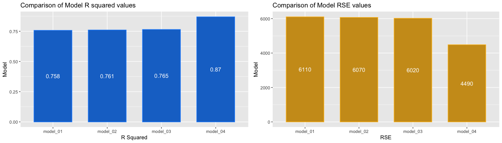

## V. Residuals and Residual Plots

1.  Calculating the model residuals

``` r
# calculate fitted values
training_data$yhat <- predict(model_04)

# calculate residuals
training_data$ehat <- residuals(model_04)
```

2.  Plotting Residual plots

<!-- -->

1.  Normality assumption
    

Residuals against fitted plot

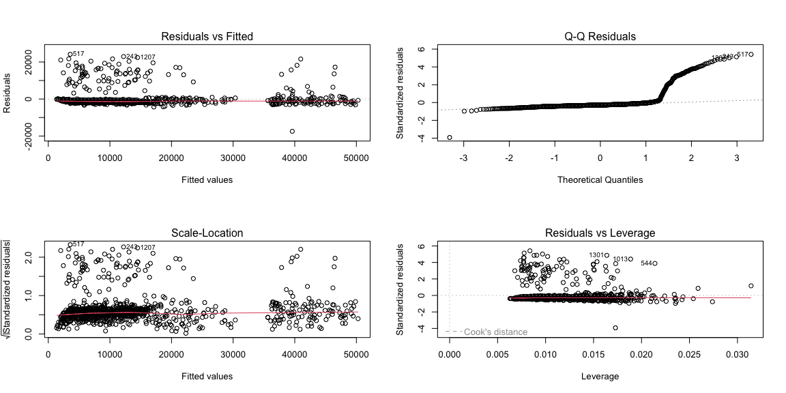

### Statistical test

1.  Shapiro-Wilks test

``` r
shapiro.test(training_data$ehat)
```

    ## 
    ##  Shapiro-Wilk normality test
    ## 
    ## data:  training_data$ehat
    ## W = 0.48954, p-value < 2.2e-16

The p-value \<0.05 which means we reject the null hypothesis. This means
that the residuals are not normally distributed.

2.  Breusch-Pagan test for constant variance

``` r
olsrr::ols_test_breusch_pagan(model_04, rhs = TRUE)
```

    ## 
    ##  Breusch Pagan Test for Heteroskedasticity
    ##  -----------------------------------------
    ##  Ho: the variance is constant            
    ##  Ha: the variance is not constant        
    ## 
    ##                                                           Data                                                           
    ##  ------------------------------------------------------------------------------------------------------------------------
    ##  Response : charges 
    ##  Variables: age age2 bmi bmi30 children sexmale smokeryes regionnorthwest regionsoutheast regionsouthwest bmi30:smokeryes 
    ## 
    ##          Test Summary          
    ##  ------------------------------
    ##  DF            =    11 
    ##  Chi2          =    25.76975 
    ##  Prob > Chi2   =    0.007021606

Results: p-value is low, reject the null hypothesis. Hence, variance is
not constant.

Check for outliers

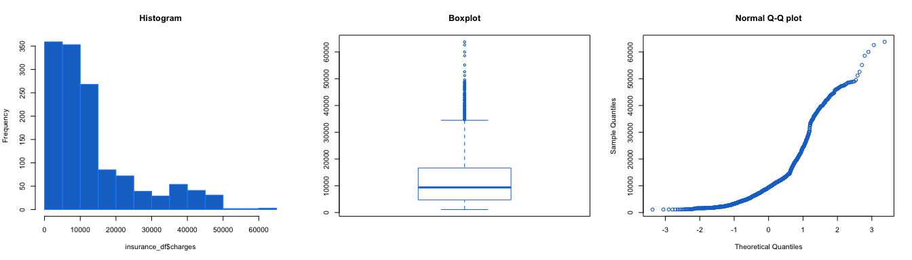

## Predicting from test data

Use test data

``` r
test_data$tst_yhat <- round(predict(model_04, newdata = test_data), 2)
```

Plot the known outcome with the predictions
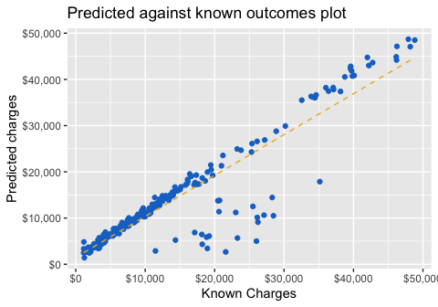
