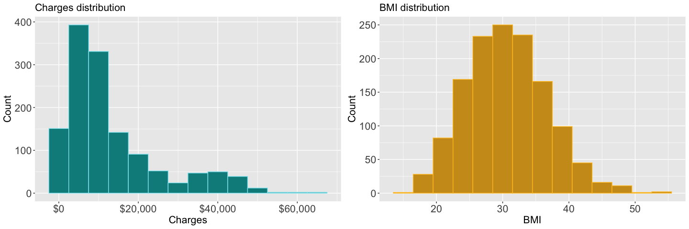
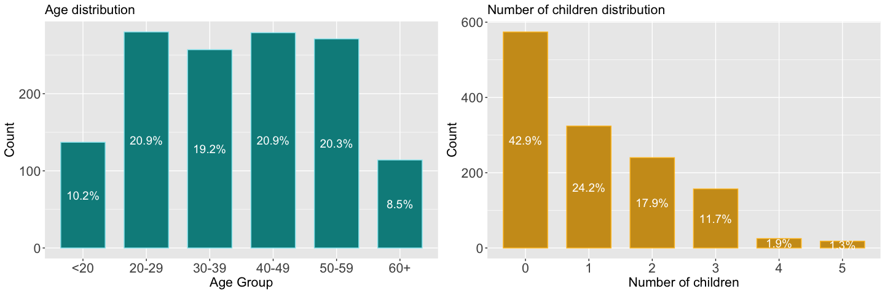
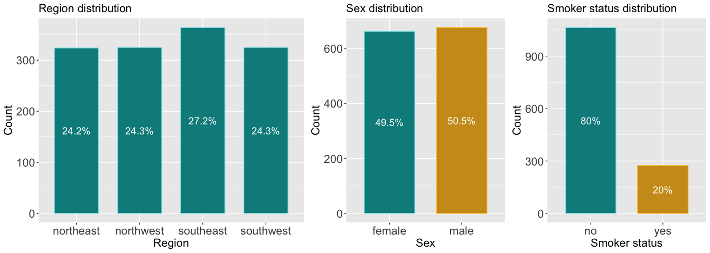
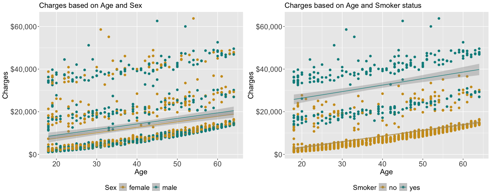

Medical expenses prediction using regression analysis in R
================

<br>

### I. Project objective

Health insurance is important because it provides protection from
disruptive medical expenses which might result from an illness,
disability or accident. Insurance companies, based on the health
insurance coverage, can reimburse the insured for medical expenses
incurred or can pay the care provider directly. It is important for
insurers to be able to forecast medical expenses so they could
accurately set yearly premiums that their beneficiaries have to pay to
avail health insurance.

Hence, this project was aimed to develop a predictive model for
estimating medical expenses based on given predictor variables using
linear regression method. In this case, predictor variables were based
on patient characteristics data.

<br>

### II. Exploratory Data Analysis

**A. Data Collection**

For this analysis, a simulated dataset containing medical expenses for
patients in the United States obtained from Kaggle was used. This
dataset was created for the book “Machine Learning with R” (by Brett
Lantz, 2013) using demographic statistics from the US Census Bureau. The
sourced dataset has 1338 records and 7 variables indicating patient
characteristics including the total medical expenses (referred as
`charges`). The variables are:

- `age` : the person’s age
- `sex` : the person’s gender, either male or female
- `bmi` : the person’s body mass index which indicates how over or
  under-weight the person is relative to their height
- `children` : the number of children (or dependents) in the person’s
  family
- `smoker` : indicates if the person is a regular smoker or not (‘yes’
  or ‘no’)
- `region` : the US geographic region where the person resides
  (‘southwest’, ‘southeast’, ‘northwest’, ‘northeast’)
- `charges` : the amount of medical expenses (in US dollars) charged to
  the insurance plan for the calendar year

<br>

**B. Data Exploration**

An initial look at the structure of the loaded dataset
(`insurance_df`)shows:

    ## 'data.frame':    1338 obs. of  7 variables:
    ##  $ age     : int  19 18 28 33 32 31 46 37 37 60 ...
    ##  $ sex     : chr  "female" "male" "male" "male" ...
    ##  $ bmi     : num  27.9 33.8 33 22.7 28.9 ...
    ##  $ children: int  0 1 3 0 0 0 1 3 2 0 ...
    ##  $ smoker  : chr  "yes" "no" "no" "no" ...
    ##  $ region  : chr  "southwest" "southeast" "southeast" "northwest" ...
    ##  $ charges : num  16885 1726 4449 21984 3867 ...

The first 10 records of the `insurance_df`:

    ##    age    sex    bmi children smoker    region   charges
    ## 1   19 female 27.900        0    yes southwest 16884.924
    ## 2   18   male 33.770        1     no southeast  1725.552
    ## 3   28   male 33.000        3     no southeast  4449.462
    ## 4   33   male 22.705        0     no northwest 21984.471
    ## 5   32   male 28.880        0     no northwest  3866.855
    ## 6   31 female 25.740        0     no southeast  3756.622
    ## 7   46 female 33.440        1     no southeast  8240.590
    ## 8   37 female 27.740        3     no northwest  7281.506
    ## 9   37   male 29.830        2     no northeast  6406.411
    ## 10  60 female 25.840        0     no northwest 28923.137

<br>

To perform EDA on `insurance_df`, univariate distribution of variables,
as well as bivariate and multivariate relationships among the variables
were investigated.

<br>

**1. Univariate Analysis**

The figures below shows the distribution plots for medical expenses and
patients BMI. The summary statistics are also described.


<br>

*Summary statistics for medical `charges`:*

    ##    Min. 1st Qu.  Median    Mean 3rd Qu.    Max. 
    ##    1122    4740    9382   13270   16640   63770

*Summary statistics for patients `bmi`:*

    ##    Min. 1st Qu.  Median    Mean 3rd Qu.    Max. 
    ##   15.96   26.30   30.40   30.66   34.69   53.13

<br>

The figures below shows the distribution bar plots for the patients’ age
group, number of children, region, sex, and smoker status. The summary
statistics are also described.

<br>



<br>


<br>

*Summary statistics for patients’ `age`:*

    ##    Min. 1st Qu.  Median    Mean 3rd Qu.    Max. 
    ##   18.00   27.00   39.00   39.21   51.00   64.00

*Distribution of number of `children` based on count:*

    ## 
    ##   0   1   2   3   4   5 
    ## 574 324 240 157  25  18

*Distribution of `region` residence based on count:*

    ## 
    ## northeast northwest southeast southwest 
    ##       324       325       364       325

*Distribution of `sex` based on count:*

    ## 
    ## female   male 
    ##    662    676

*Distribution of `smoker` status based on count:*

    ## 
    ##   no  yes 
    ## 1064  274

<br>

**2. Bivariate Analysis**

The figures below show the bivariate relationships of `charges` to
`sex`, `region`, `smoker` and `children`.


<br>


<br>

The plot of `charges` against `smoker` clearly shows that the median
charges for smokers are higher than non-smokers, and that the IQR are
also larger for smokers. In terms of `region`, the median `charges` are
almost same across all four regions, though the IQR or dispersion is
highest for southeast. The same is observed in the plot of `charges`
against `sex` where median charges is same between females and males
though data on males have larger IQR. For the plot of `charges` against
`children`, the median charges was observed to be increasing from having
one child to having four children, while median charges for those
without children is quite higher and lower for those with five children.

<br>

**3. Multivariate Analysis**

The figures below show the multivariate relationships of `charges`,
`age`, `sex`, `smoker` and `bmi`.


<br>


<br>

The plots above show positive correlation between `charges` and `age`
and between `charges` and `bmi`. It is also evident from the plots that
there is not much difference in the correlation in terms of `sex` as
compared to the correlation difference of `smoker`. In the plot of
`charges` against `bmi` and `smoker`, the slope of the positive
correlation line for smokers is steeper than the line for non-smoker at
increasing BMI. This suggests possible interaction effect of `smoker`
and `bmi`.

<br>

The figure below shows the **correlation** among the variables. Clearly,
`smoker` (yes) has the highest positive correlation with `charges`,
followed by `age` and `bmi`.


<br>

### III. Evaluation of Linear Regression Models

**A. Splitting the dataset**

The dataset was split into training data set (80%) and test data set
(20%). The training data set was used to build the linear regression
model and the test data set was used to evaluate the performance of the
final model.

``` r
RNGkind(sample.kind = "Rounding")
set.seed(42)

train_index <-  sample(nrow(insurance_df), nrow(insurance_df)*0.8)

training_data <- insurance_df[train_index, ]
test_data <- insurance_df[-train_index, ]

nrow(training_data)
```

    ## [1] 1070

``` r
nrow(test_data)
```

    ## [1] 268

<br>

**B. Linear regression models**

For this analysis, 4 models were evaluated, starting from a general
simple model to an improved regression model.

1.  Model 1 - General model including all independent variables
2.  Model 2 - With added non-linear relationship
3.  Model 3 - With added transformed variable
4.  Model 4 - With added interaction relationship

Model results are detailed below.

<br>

**Model 1 - General model including all independent variables**

This model fits a linear regression model that relates all 6 independent
variables with the target `charges` variable (medical expenses).

<div align="center">

*charges = $\beta_{0}$ + $\beta_{1}$age + $\beta_{2}$bmi +
$\beta_{3}$children + $\beta_{4}$sex + $\beta_{5}$smoker +
$\beta_{6}$region + $\epsilon$*

</div>

<div align="center">

*charges = $\beta_0$ + $\beta_1$age + $\beta_2$bmi + $\beta_3$children +
$\beta_4$sex + $\beta_5$smoker + $\beta_6$region + $\epsilon$*

</div>

``` r
model_01 <- lm(charges ~ age + bmi + children + sex + smoker + region, data = training_data)

summary(model_01)
```

    ## 
    ## Call:
    ## lm(formula = charges ~ age + bmi + children + sex + smoker + 
    ##     region, data = training_data)
    ## 
    ## Residuals:
    ##      Min       1Q   Median       3Q      Max 
    ## -11514.2  -2822.8   -928.6   1514.4  29451.4 
    ## 
    ## Coefficients:
    ##                  Estimate Std. Error t value Pr(>|t|)    
    ## (Intercept)     -12318.92    1103.51 -11.163  < 2e-16 ***
    ## age                257.79      13.37  19.281  < 2e-16 ***
    ## bmi                347.54      31.88  10.901  < 2e-16 ***
    ## children           511.23     155.54   3.287  0.00105 ** 
    ## sexmale            182.50     374.69   0.487  0.62630    
    ## smokeryes        24177.04     463.55  52.156  < 2e-16 ***
    ## regionnorthwest   -446.83     533.98  -0.837  0.40290    
    ## regionsoutheast  -1050.89     539.87  -1.947  0.05185 .  
    ## regionsouthwest  -1342.26     541.18  -2.480  0.01328 *  
    ## ---
    ## Signif. codes:  0 '***' 0.001 '**' 0.01 '*' 0.05 '.' 0.1 ' ' 1
    ## 
    ## Residual standard error: 6105 on 1061 degrees of freedom
    ## Multiple R-squared:  0.7577, Adjusted R-squared:  0.7559 
    ## F-statistic: 414.7 on 8 and 1061 DF,  p-value: < 2.2e-16

<br>

The ‘estimate’ values in above model results refer to the estimated beta
coefficients which indicate the increase in `charges` for an increase in
each of the independent variable when the other variables are held
constant. For instance, assuming everything else is equal, an additional
child will result to an average of \$511 additional medical expenses
(`charges`) per year. Furthermore, smokers have an average of \$24,177
more in medical expenses compared to non-smokers.

<br>

**Model 2 - With added non-linear relationship**

This model includes a higher order term added to the regression Model 1
to account for a possible nonlinear relationship of the target variable
to one of the independent variables. In this instance, the effect of
`age` on `charges` may not be constant in all ages and that expenses may
be disproportionately higher for older patients. Hence, a variable
`age2` with values equivalent to `age` squared was created.

<div align="center">

*charges = $\beta_{0}$ + $\beta_{1}$age + $\beta_{2}$age^{2} +
$\beta_{3}$bmi + $\beta_{4}$children + $\beta_{5}$sex +
$\beta_{6}$smoker + $\beta_{7}$region + $\epsilon$*

</div>

``` r
model_02 <- lm(charges ~ age + age2 + bmi + children + sex + smoker + region, data = training_data)

summary(model_02)
```

    ## 
    ## Call:
    ## lm(formula = charges ~ age + age2 + bmi + children + sex + smoker + 
    ##     region, data = training_data)
    ## 
    ## Residuals:
    ##      Min       1Q   Median       3Q      Max 
    ## -12258.4  -2931.9   -880.3   1405.7  30317.4 
    ## 
    ## Coefficients:
    ##                  Estimate Std. Error t value Pr(>|t|)    
    ## (Intercept)     -6735.221   1901.359  -3.542 0.000414 ***
    ## age               -65.384     90.846  -0.720 0.471857    
    ## age2                4.072      1.132   3.596 0.000338 ***
    ## bmi               342.120     31.738  10.779  < 2e-16 ***
    ## children          693.864    162.795   4.262  2.2e-05 ***
    ## sexmale           174.953    372.603   0.470 0.638779    
    ## smokeryes       24202.658    461.020  52.498  < 2e-16 ***
    ## regionnorthwest  -488.372    531.125  -0.920 0.358041    
    ## regionsoutheast -1057.449    536.859  -1.970 0.049133 *  
    ## regionsouthwest -1350.527    538.171  -2.509 0.012239 *  
    ## ---
    ## Signif. codes:  0 '***' 0.001 '**' 0.01 '*' 0.05 '.' 0.1 ' ' 1
    ## 
    ## Residual standard error: 6071 on 1060 degrees of freedom
    ## Multiple R-squared:  0.7606, Adjusted R-squared:  0.7586 
    ## F-statistic: 374.2 on 9 and 1060 DF,  p-value: < 2.2e-16

<br>

The result of this model shows that `charges` is more significantly
related to `age2` than `age`.

<br>

**Model 3 - With added transformed variable**

This model also considers the possibility of `bmi` as not having a
cumulative effect, but when BMI value is over a specific threshold
value. This implies possibly no effect on medical expenses when patient
is with normal weight but may have strong effect when patient is obese,
i.e., when BMI is 30 or above. Hence, a binary indicator variable
`bmi30` was created which has a value of 1 for `bmi` of at least 30, and
0 otherwise.

<div align="center">

*charges = $\beta_{0}$ + $\beta_{1}$age + $\beta_{2}$age^{2} +
$\beta_{3}$bmi + $\beta_{4}$bmi30 +$\beta_{5}$children +
$\beta_{6}$sex + $\beta_{7}$smoker + $\beta_{8}$region + $\epsilon$*

</div>

``` r
model_03 <- lm(charges ~ age + age2 + bmi + bmi30 + children + sex + smoker + region, data = training_data)

summary(model_03)
```

    ## 
    ## Call:
    ## lm(formula = charges ~ age + age2 + bmi + bmi30 + children + 
    ##     sex + smoker + region, data = training_data)
    ## 
    ## Residuals:
    ##    Min     1Q Median     3Q    Max 
    ## -13038  -3420     40   1537  28850 
    ## 
    ## Coefficients:
    ##                  Estimate Std. Error t value Pr(>|t|)    
    ## (Intercept)     -3173.914   2056.737  -1.543 0.123086    
    ## age               -40.123     90.281  -0.444 0.656830    
    ## age2                3.764      1.125   3.345 0.000852 ***
    ## bmi               165.083     51.556   3.202 0.001405 ** 
    ## bmi30            2681.276    618.425   4.336 1.59e-05 ***
    ## children          690.928    161.446   4.280 2.04e-05 ***
    ## sexmale           130.021    369.659   0.352 0.725108    
    ## smokeryes       24177.907    457.233  52.879  < 2e-16 ***
    ## regionnorthwest  -561.181    526.990  -1.065 0.287173    
    ## regionsoutheast  -899.938    533.646  -1.686 0.092014 .  
    ## regionsouthwest -1322.297    533.749  -2.477 0.013390 *  
    ## ---
    ## Signif. codes:  0 '***' 0.001 '**' 0.01 '*' 0.05 '.' 0.1 ' ' 1
    ## 
    ## Residual standard error: 6021 on 1059 degrees of freedom
    ## Multiple R-squared:  0.7648, Adjusted R-squared:  0.7626 
    ## F-statistic: 344.3 on 10 and 1059 DF,  p-value: < 2.2e-16

<br> The result shows that both `bmi` and `bmi30` have significant
effect on medical expenses.

<br>

**Model 4 - With added interaction relationship**

This model considers the possibility of an interaction or combined
effect of the variables `bmi30` and `smoker` (obesity and smoking) on
the medical expenses. Hence, an interaction form `bmi30:smoker` was
added.

<div align="center">

*charges = $\beta_{0}$ + $\beta_{1}$age + $\beta_{2}$age^{2} +
$\beta_{3}$bmi + $\beta_{4}$bmi30 + $\beta_{5}$children +
$\beta_{6}$sex + $\beta_{7}$smoker + $\beta_{8}$bmi30:smoker +
$\beta_{9}$region + $\epsilon$*

</div>

``` r
model_04 <- lm(charges ~ age + age2 + bmi + bmi30 + children + sex + smoker + bmi30:smoker + region, data = training_data)

summary(model_04)
```

    ## 
    ## Call:
    ## lm(formula = charges ~ age + age2 + bmi + bmi30 + children + 
    ##     sex + smoker + bmi30:smoker + region, data = training_data)
    ## 
    ## Residuals:
    ##      Min       1Q   Median       3Q      Max 
    ## -17451.9  -1670.2  -1260.9   -709.1  24158.5 
    ## 
    ## Coefficients:
    ##                   Estimate Std. Error t value Pr(>|t|)    
    ## (Intercept)      -247.7558  1535.3400  -0.161  0.87183    
    ## age               -22.9139    67.2527  -0.341  0.73339    
    ## age2                3.6299     0.8382   4.331 1.63e-05 ***
    ## bmi               123.7649    38.4299   3.221  0.00132 ** 
    ## bmi30            -984.2396   477.5013  -2.061  0.03953 *  
    ## children          708.2025   120.2624   5.889 5.22e-09 ***
    ## sexmale          -439.4342   276.0494  -1.592  0.11171    
    ## smokeryes       13500.9833   500.0302  27.000  < 2e-16 ***
    ## regionnorthwest  -343.4624   392.6242  -0.875  0.38189    
    ## regionsoutheast  -834.7933   397.5177  -2.100  0.03596 *  
    ## regionsouthwest -1281.6470   397.5907  -3.224  0.00130 ** 
    ## bmi30:smokeryes 19894.3721   682.1518  29.164  < 2e-16 ***
    ## ---
    ## Signif. codes:  0 '***' 0.001 '**' 0.01 '*' 0.05 '.' 0.1 ' ' 1
    ## 
    ## Residual standard error: 4485 on 1058 degrees of freedom
    ## Multiple R-squared:  0.8696, Adjusted R-squared:  0.8683 
    ## F-statistic: 641.5 on 11 and 1058 DF,  p-value: < 2.2e-16

<br> The result shows a significant effect on medical expenses of
combined obesity and smoking.

<br>

**C. Comparing the models**

    ##     models        r2      rse
    ## 1 model_01 0.7558697 6105.411
    ## 2 model_02 0.7585846 6071.368
    ## 3 model_03 0.7625711 6021.031
    ## 4 model_04 0.8682573 4485.051

The four models were compared in terms of the ‘residual standard error
(RSE)’ and the ‘R-squared’ values to determine which model has the
better fit for the dataset .

Since RSE measures the standard deviation of the residuals (i.e.,
observed value minus the predicted value)in the regression model, the
model with the smaller RSE is the better regression model that fit the
dataset. On the other hand, the multiple R-squared value, called
coefficient of determination, indicates how well a model as a whole
explains the values of the dependent variable. The closer the value of
this R-squared to 1.0, the better the model explains the data. However,
since the four models have different numbers of explanatory variables,
the ‘adjusted R-squared value’ were used for comparison. The adjusted
R-squared corrects the multiple R-squared with penalty based on number
of variables in the model.

Based on the figures below, **Model 4** has the smallest RSE and highest
adjusted R-squared, and hence, is the regression model that better fits
the dataset.


<br>

**D. Predicting from test data**

The performance of Model 4 on new data was evaluated using the test
data. Predicted values of `charges` for the test data were obtained and
plotted against known `charges` and shown in the figure below. The plot
shows a good predictive performance to medical expenses around \$20,000
but slightly overpredict on `charges` above this. There are also few
points showing large deviation of predicted from known values of
`charges` in the test data.


<br> <br>

### IV. Conclusion

In this project, predictive models for determining medical expenses
based on certain patient characteristics were developed and compared.
The selected model below, Model 4, which is an improved model including
an added non-linear relationship (`age2`), a transformed variable
(`bmi30`) and an interaction relationship (`bmi30:smoker`) was
determined to have the better fit to the dataset among the models,
evident from its smallest RSE (4490) and highest adjusted RSE (0.87).

``` r
model_04 <- lm(charges ~ age + age2 + bmi + bmi30 + children + sex + smoker + bmi30:smoker + region, data = training_data)
```

Based on the summary of Model 4, the variables with the greatest
predictive power are `age2`, `children`, `smokeryes` and
`bmi30:smokeryes`. A child or dependent has an averaged increased cost
of \$708 in medical expenses per year. Furthermore, a smoker has an
average increased cost of \$13,500 per year, and an obese smoker will
have an additional \$19,894 per year in medical expenses.

Although the model has good R-squared result, the plot showing predicted
`charges` against known `charges` of the test data shows that the
regression model does not perfectly fit the dataset. As the dataset
seemed not large enough, adding more data (observations) to the dataset
might improve the model and increase accuracy of the model in
forecasting medical expenses. Moreover, further investigation and action
on the outliers could also help in building more fitting models.

<br> <br> <br>
